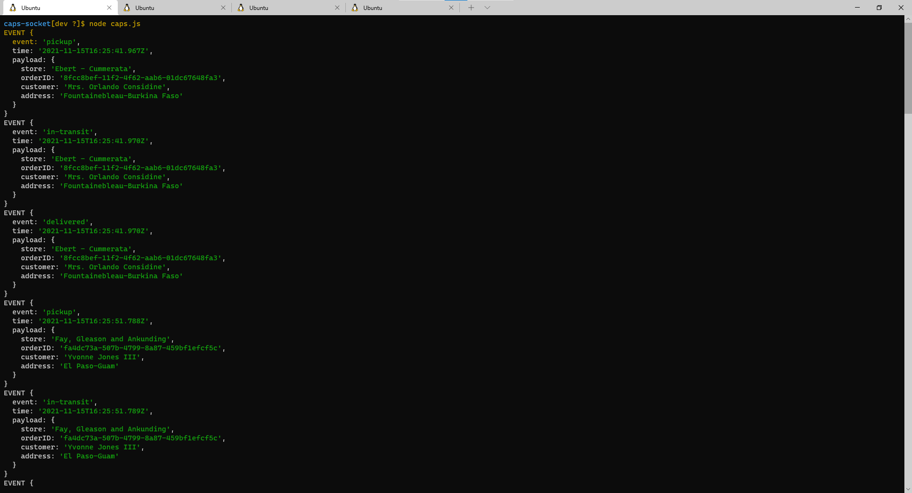
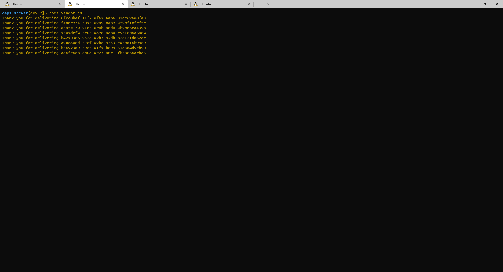
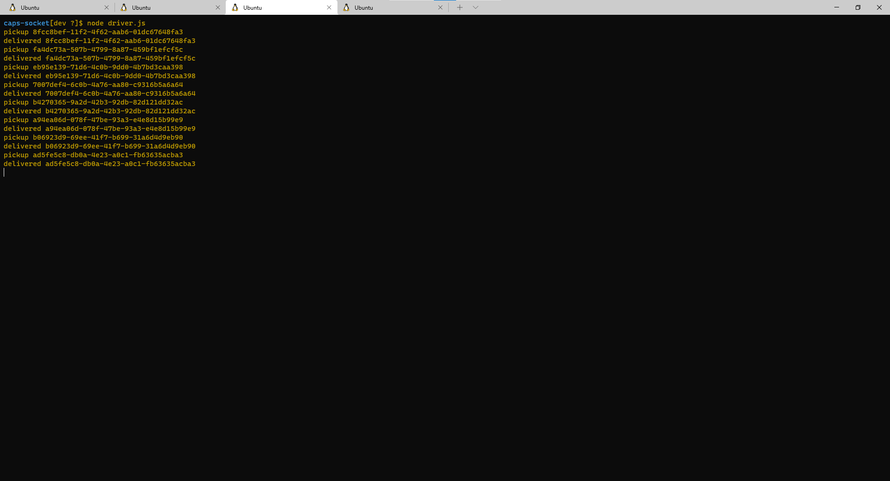
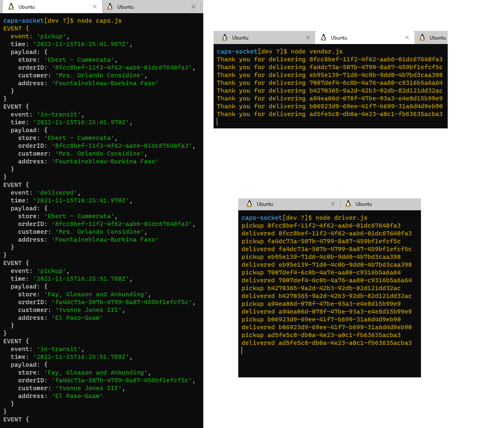
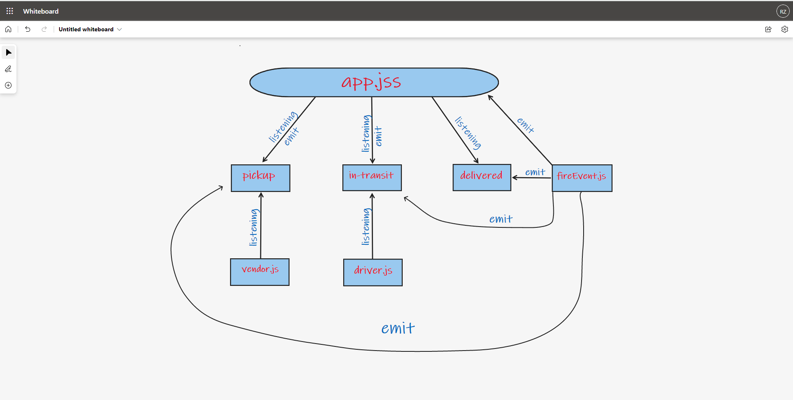

# caps-socket

## Lab 11
## Author: 
- Rami Zregat

**Description of the lab:**  
In this lab, we’ll be moving away from using Node Events for managing events, instead refactoring to using socket.io , which takes on some of the complexity we had to manage ourselves, and also works equally well between servers and with websites.

## Links to check:

- Github pull request link: https://github.com/RamiZregat/caps-socket/pull/1
- Github actions link: https://github.com/RamiZregat/caps-socket/actions

## Dependencies:  

- jest
- faker
- socket.io
- socket.io-client

## How to start the application:  
- node caps.js
- node vendor.js
- node driver.js
- node fireEvent.js

## Output result

## UML

